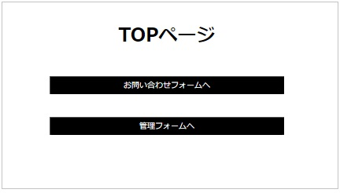
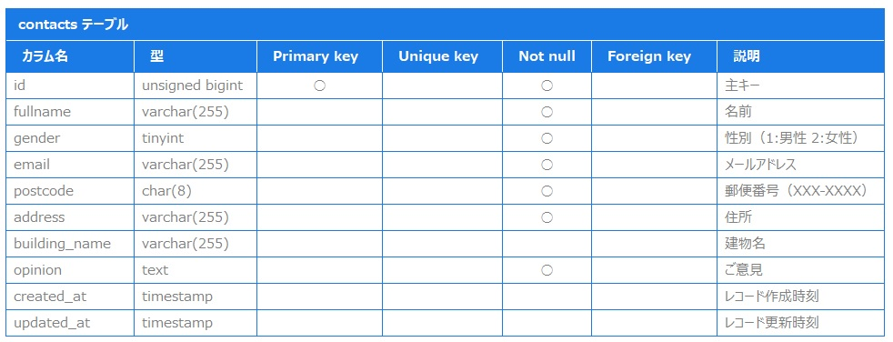
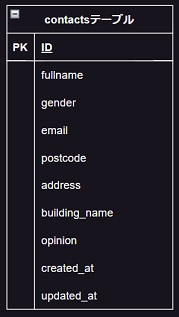

# 20230623_Nakaba_AdvanceTest_0
# 意見集約／管理アプリ
 
 

## 機能概要
ユーザからのご意見を所定のフォームにて入力・送信頂き、管理画面上のデータ一覧にて検索・削除ができるアプリ

下記画面で構成される

-　ＴＯＰページ

->　お問い合わせフォーム（入力画面・確認画面・完了画面）

->　管理画面（データ一覧閲覧　－　検索・削除機能付き）

## URL
http://localhost

## 機能一覧
-　お問い合わせフォーム

->　入力エラーチェック機能（入力時＋送信時）

-　管理画面

->　複数条件による検索機能

->　マウスオーバでの隠れ文字の全文表示機能

->　データ削除機能　

## 使用技術（実行環境）

-　Laravel 9.52.9

-　PHP 8.0.2

## テーブル設計

## ER図

